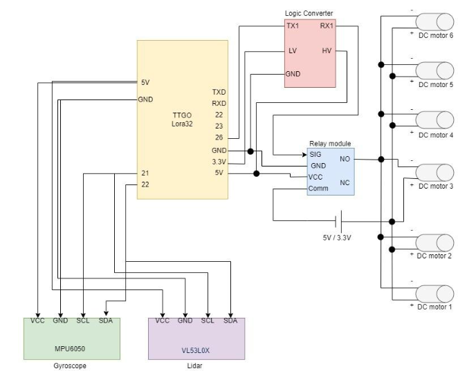

# 🚀 Soft Landing Mechanism using LoRa32

## Overview:
The Soft Landing Mechanism is designed to ensure a controlled and safe landing for aerial or space vehicles. The system detects descent, analyzes stability, and activates thrusters/motors to reduce impact force, preventing damage to the vehicle and payload.

## 🛠️ Hardware Requirements  
- LilyGO TTGO T3 LoRa32 433MHz V1.1.6 ESP32 with a built-in LoRa chip and an OLED display (128x64 pixels)
- 2 Pole 5V Single Channel Relay Module
- I2C Logic Level Converter 4 Channel Bi-directional Module
- Gyroscope Sensor MPU6050 
- VL53L0X TOF Based Lidar Lasar Distance Sensor
- 3.7V 6000 RPM Mini Drone DC Motor Shaft 
- Wi-Fi Connection

## 🛠️ Software Requirements
- Arduino IDE 
  
## 🔌  LORA ESP32 TTGO LoRa T3 V1.6 Pin Diagram


## 🔧 Circuit Diagram


## 📡 How It Works
1.**Sensor Data Acquisition**: 
- MPU6050 detects orientation and movement.
- VL53L0X measures the altitude.
- ESP32 reads the sensor data via I2C.
  
2.**Processing & Decision Making**:
- If altitude (LiDAR) is above threshold → motors remain off.
- If descent is detected (altitude decreasing rapidly) → MPU6050 checks for stability.
- If a critical height is reached (e.g., 100m above the ground), ESP32 decides to activate the thrusters/motors.
  
3.**Motor Activation via Relay**:
- ESP32 sends a signal to the relay module.
- Relay module switches ON the motors (e.g., opening thrusters).
  
4.**Communication via LoRa**:
- ESP32 transmit landing status via LoRa.
- A Web Server continuosly receive altitude/motion and orientation real time data with graphs.
  
5.**Landing Completion:**:
- Once altitude reaches 0, ESP32 turns off motors.
- Landed Successfully

## ⚙️ Installation & Setup  
1. **Install Required Libraries:**
   *Transmmiter*
   - VL53L0X
   - ESP32_Servo
   - Adafruit_MPU6050
   - Adafruit_Sensor
   - Wire
   - SPI
   - LoRa
   - Adafruit GFX
   - Adafruit SSD1306
 
   *Receiver* 
   - WiFi  
   - ESPAsyncWebServer  
   - SPI
   - SPIFFS  
   - LoRa  
   - Wire  
   - Adafruit GFX  
   - Adafruit SSD1306  
   - NTPClient
   - WiFiUdp 
   - ArduinoJson

2. **Upload the Code to LoRa Module**
   
4. **Update Wi-Fi Credentials in the Receiver Code:**  
   ```cpp
   const char* ssid = "YourWiFiSSID";
   const char* password = "YourWiFiPassword";

5. ## 🖥️ Web Dashboard 
- The receiver ESP32 hosts a **Web Server**.
- View live **altitude, acceleration, and LoRa signal strength** in JSON format.
- Find the ESP32's IP address (printed in Serial Monitor).
- Open a web browser and enter the ESP32's IP address to view live data.
- Alternatively, open the index.html file directly in a browser.
- *Note: Remember that index.html file should be in folder of receiver code*. 

---

## 🛠 Applications
✅ **Drones & UAVs** – Ensures safe landing for emergency landings.  
✅ **Space Missions** – Assists in controlled payload landings.  
✅ **Aerial Delivery Systems** – Protects cargo during descent.  

---

## 📌 Future Enhancements
🔹 **PID Control for More Precise Landing**  
🔹 **Integration with GPS for Outdoor Landings**  
🔹 **Real-time Cloud Data Logging**  

---

## 📜 License
This project is **open-source** and licensed under the **MIT License**.

---

## 🤝 Contributing
Pull requests are welcome! For major changes, please open an issue first to discuss.

👨‍💻 Developed by **Nidhee Vishwanath Salvi**  
🌟 Star this repository if you found it useful!


